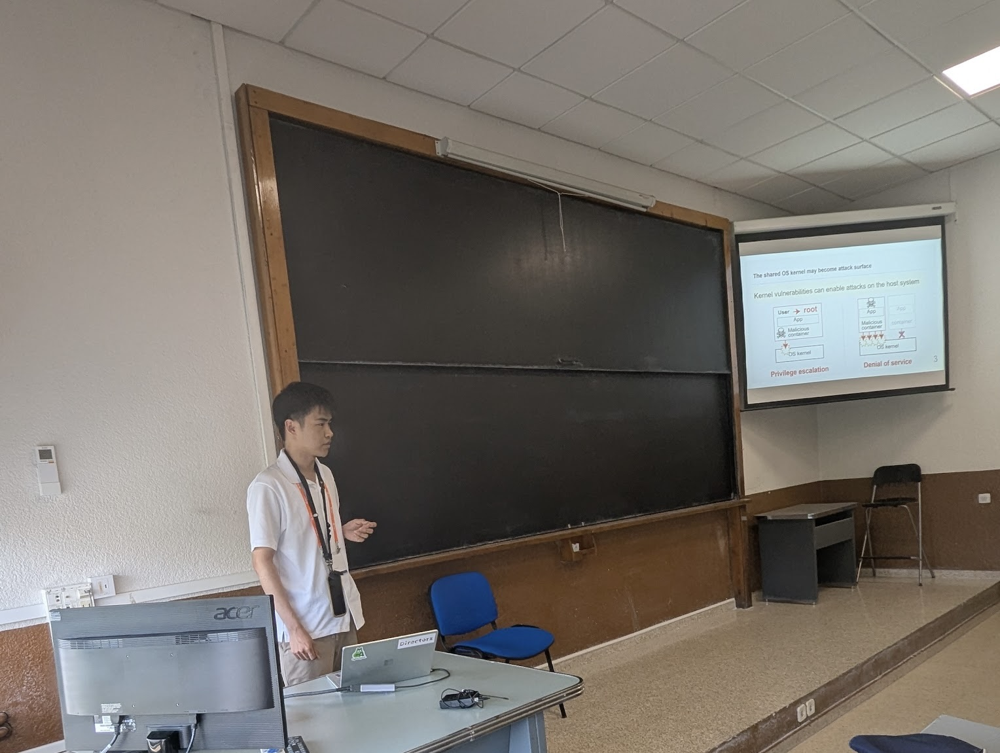

2026年7月7日から10日にスペインで開催された、IEEE International Conference on Computers, Software, and Applications （COMPSAC）の併設ワークショップ14th IEEE International Workshop on Architecture, Design, Deployment, and Management of Networks and Applications（ADMNET 2026）で博士（前期）課程1年の坂本が発表しました。
FreeBSDのセキュリティ機構を活用したLinuxコンテナ向けサンドボックス機構について発表しました。

[論文（IEEE Xplore）](https://ieeexplore.ieee.org/abstract/document/11645485/)

